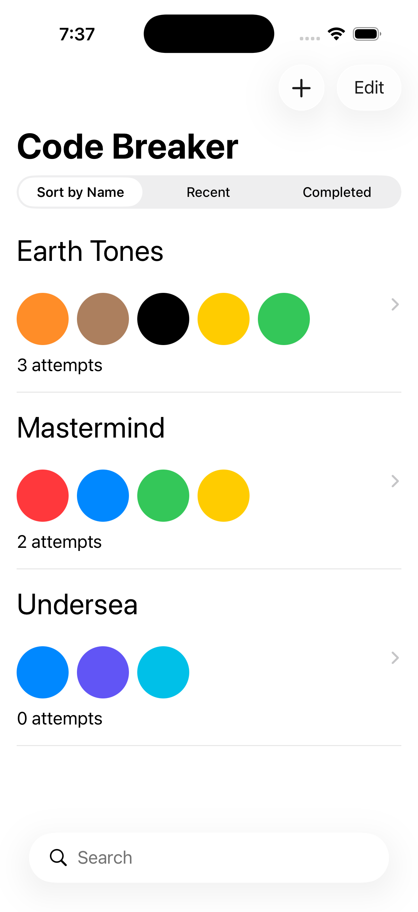
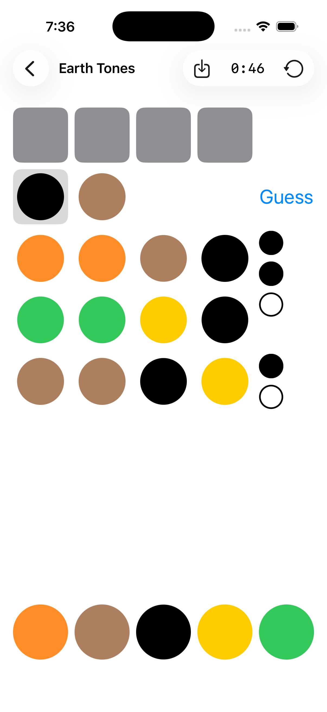
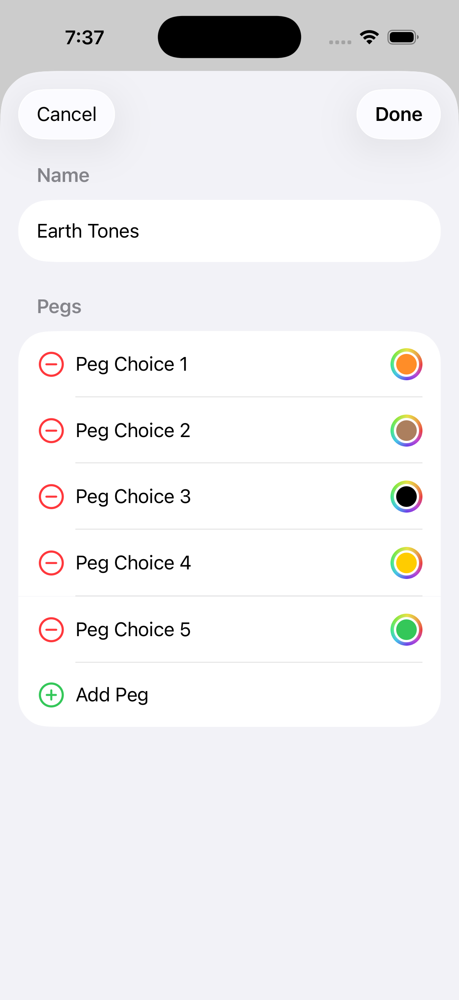

# 📱 CodeBreaker

## 📖 Introduction

CodeBreaker is an iOS app I built from scratch as part of my learning journey through Stanford's [CS193p — Developing Apps for iOS (Spring 2025)](https://cs193p.stanford.edu/) course. The project explores core concepts like declarative UIs with SwiftUI, data flow and state management, animations, and data persistence with SwiftData.


**Game Overview:** CodeBreaker is a code-breaking puzzle game inspired by the classic Mastermind board game. Instead of jumping straight into gameplay, players can first customize their experience—choosing difficulty, colors, and game modes. Once ready, they attempt to guess a secret sequence of colored pegs. After each guess, feedback pins indicate proximity to the solution, helping players progressively narrow down the correct combination.

---

## 📸 Screenshots

| Game List | Game Play | Game Editor |
|:---:|:---:|:---:|
|  |  |  |

---

## 🎓 Key Learnings

- 🧱 **SwiftUI Fundamentals**
- 🔁 **State Management**
- 📐 **Layout System**
- 🎨 **Animation & Transitions**
- ⏱️ **Swift Protocols**
- 📋 **Navigation**
- 📱 **Adaptive Layouts**
- ✏️ **Forms**
- 💾 **SwiftData**
- 🧵 **Concurrency**
- 🎯 **Custom Shapes & Gestures**
- 🔧 **Alternative Persistence Data**

---

## 🚀 How to Run

1. Clone the repository
   ```bash
   git clone https://github.com/KusalPriyanka/codebreaker.git
   cd codebreaker
   ```

2. Open in Xcode
   ```bash
   open codebreaker.xcodeproj
   ```

3. Select a simulator or device in the Xcode toolbar

4. Press `⌘ + R` to build and run

**Requirements:** Xcode 26+, iOS 26.0+ simulator or device
